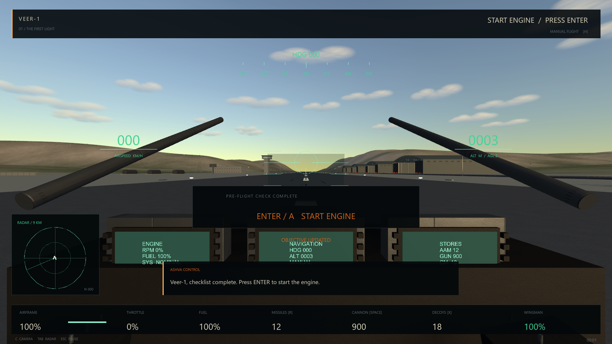
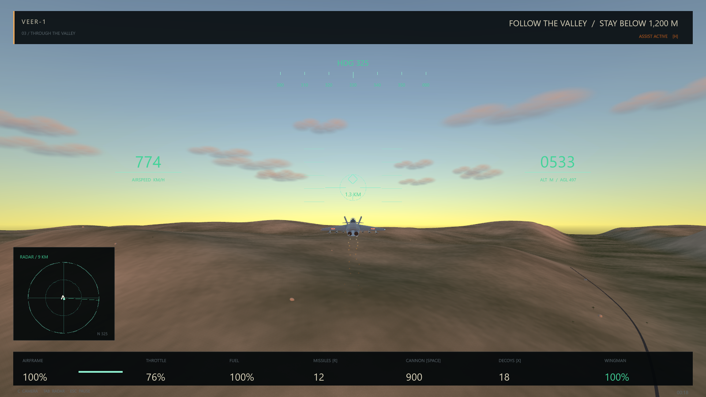

<<<<<<< HEAD
# ✈️ OPERATION SINDOOR

### A Fictional Single-Player Aviation Campaign Built with Unity
=======
<p align="center">
  
</p>

<h1 align="center">Operation Sindoor</h1>

<p align="center">
  <strong>Take flight. Follow the story. Find your way home.</strong><br>
  A fictional aviation campaign with cinematic briefings, aerial combat, and a connected five-mission journey.
</p>

<p align="center">
  <strong>Windows</strong> &nbsp; / &nbsp; Single-player &nbsp; / &nbsp; Unity 6 &nbsp; / &nbsp; C# &nbsp; / &nbsp; Universal Render Pipeline
</p>

<p align="center">
  <a href="#play">Play</a> &nbsp; · &nbsp;
  <a href="#campaign">Campaign</a> &nbsp; · &nbsp;
  <a href="#controls">Controls</a> &nbsp; · &nbsp;
  <a href="#build-and-validate">Build &amp; validate</a> &nbsp; · &nbsp;
  <a href="#documentation">Documentation</a>
</p>

---

## The experience

Fly from the first engine start to the final landing through five linked missions. Story sequences lead into flight, while cockpit and chase cameras offer two perspectives on an original procedural world.

| In the air | On the ground | Across the campaign |
| :--- | :--- | :--- |
| Aerial interception, guided missiles, cannon, and countermeasures | Directed briefings, preparation, and homecoming sequences | Five connected missions with changing objectives and weather |
| Cockpit instruments, radar, and selectable targets | Original aircraft, characters, and modular airbase scenery | Persistent unlocks, scores, settings, and input bindings |
| Optional route and landing assistance | PBR materials, terrain LODs, particle effects, and synthesized audio | Session checkpoints for recovering major objectives |

### Flight gallery

<table>
  <tr>
    <td width="50%"></td>
    <td width="50%"></td>
  </tr>
  <tr>
    <td align="center"><strong>Pre-flight</strong><br>Cockpit view and flight instruments</td>
    <td align="center"><strong>Through the valley</strong><br>Chase view during mission three</td>
  </tr>
</table>

<sub>In-game captures from local automated playtests. The animated header is decorative. The project uses stylized procedural art; see the production notes below for its current scope.</sub>
>>>>>>> c887415 (Updating README)

<p align="center">
  <strong>Fly. Defend. Survive. Return Home.</strong>
</p>

<<<<<<< HEAD
<p align="center">
  
  
  
  
</p>

<p align="center">
  
  
  
</p>

---

## 🎮 Overview

**Operation Sindoor** is a fictional single-player aviation campaign created in Unity for Windows.
=======
**Have a Windows build?** Run `Builds/Windows/OperationSindoor.exe`. Keep the executable alongside `UnityPlayer.dll`, `MonoBleedingEdge`, and `OperationSindoor_Data`. Unity is not required to play.

**Have the portable ZIP?** Extract all of `Builds/OperationSindoor-Windows.zip`, then launch `OperationSindoor/OperationSindoor.exe` inside the extracted folder. The archive includes documentation and validation reports.

**Starting from source?** Build the player using the [developer workflow](#build-and-validate). `Builds/` and `Artifacts/` are local outputs excluded from Git.

### Your first flight

1. Choose **PLAY** and press <kbd>Enter</kbd> to advance cinematic shots.
2. In the cockpit, press <kbd>Enter</kbd> to start the engine.
3. Hold <kbd>W</kbd> to raise the throttle, then use <kbd>↓</kbd> to raise the nose.
4. Follow the mission prompts. Press <kbd>H</kbd> to toggle route assistance, including landing.

> **Assistance stays optional.** Manual pitch, yaw, or roll disengages it. In combat, assistance turns toward the selected target; you still control weapons and countermeasures.
>>>>>>> c887415 (Updating README)

The project combines:

<<<<<<< HEAD
* ✈️ Aircraft flight simulation
* 🎯 Target identification and combat
* 📡 Radar and target-lock mechanics
* 🚀 Guided missiles
* 🔫 Aircraft cannon
* 💥 Damage and countermeasure systems
* 🌩️ Dynamic mission environments
* 🎬 Story-driven cinematic sequences
* 🛬 Takeoff, navigation and landing
* 💾 Persistent campaign progression
* 🔄 Mission checkpoints and recovery
* 🎥 Cockpit and chase cameras
* 🗺️ Procedurally generated environments
* 🧪 Automated build and gameplay validation

The campaign consists of **five connected missions**, with each mission progressing the story and introducing different flight and combat objectives.
=======
| Mission | Name | Flight brief |
| :---: | :--- | :--- |
| **01** | **Scramble** | Start up, take off, identify a training contact, engage, return, and land. |
| **02** | **Air Defence** | Protect the formation against an interception. |
| **03** | **Operation Sindoor** | Navigate a valley, engage two fictional military relays, and withdraw through defensive combat. |
| **04** | **The Long Return** | Face an airborne interception in storm conditions with limited missiles. |
| **05** | **Homecoming** | Approach, land, shut down, and close the story with a reunion and tribute. |

<details>
<summary><strong>Progress, checkpoints, and save location</strong></summary>

Restore the last major objective checkpoint from the pause or failure menu. In-flight checkpoints are **session-local**; campaign unlocks, scores, settings, and bindings persist between sessions.

Save location on Windows:

```text
%USERPROFILE%/AppData/LocalLow/Sentinel Studio/Operation Sindoor/campaign.json
```

A backup provides recovery if the primary save is damaged.

</details>

## Controls

| Flight | Input | Combat & systems | Input |
| :--- | :--- | :--- | :--- |
| Throttle up / down | <kbd>W</kbd> / <kbd>S</kbd> | Select / identify target | <kbd>F</kbd> |
| Nose down / up | <kbd>↑</kbd> / <kbd>↓</kbd> | Guided missile, after lock | <kbd>R</kbd> |
| Roll | <kbd>A</kbd> / <kbd>D</kbd> | Cannon | <kbd>Space</kbd> |
| Yaw | <kbd>Q</kbd> / <kbd>E</kbd> | Chaff / flare | <kbd>X</kbd> |
| Mouse steering | Hold right mouse + move | Cockpit / chase view | <kbd>C</kbd> |
| Afterburner | <kbd>Left Shift</kbd> | Radar | <kbd>Tab</kbd> |
| Route assistance | <kbd>H</kbd> | Pause | <kbd>Esc</kbd> |

<kbd>Enter</kbd> starts or shuts down the engine and advances cinematics, depending on context.

Primary action keys can be rebound in **Controls**. Controller flight is supported, with mappings shown in that menu; menus use a mouse.
>>>>>>> c887415 (Updating README)

The project is designed around a reusable gameplay architecture rather than a collection of isolated scenes.

<<<<<<< HEAD
---

## ⚠️ Important Notice

> **Operation Sindoor is a fictionalized video game project created for entertainment and software-development purposes.**

The game does **not** represent real military operations.

Characters, locations, missions, dialogue, scenarios and gameplay systems are fictionalized.

The project does not represent:

* Real operational routes
* Real coordinates
* Real military targets
* Real personnel identities
* Real weapon parameters
* Real-world casualty information
=======
### Requirements

| Component | Project version |
| :--- | :--- |
| Unity Editor | **6000.6.0f1** with Windows Build Support |
| Universal Render Pipeline | **17.6.0** |
| Input System | **1.19.0** |
| Windows player backend | **Mono** — no C++ toolchain required |

The project uses a **Unity 6 Update release**, not an LTS editor. Older editors require package migration.

Open the project in the matching editor and choose **Operation Sindoor → Setup and build**. This generates content and all scene gateways, validates the project, and builds the Windows player. No manual GameObject, material, prefab, or scene assembly is required.

### PowerShell workflow

Run these commands from the repository root, with the project closed in the Unity Editor before the batch build:

```powershell
# Generate content, validate, and build the Windows player.
.\Tools\Build.ps1

# Exercise all five missions with an accelerated automated pilot.
.\Tools\Playtest.ps1

# Capture assets and sample normal-speed transit frames.
.\Tools\ReviewAssets.ps1

# Compare protected gameplay against the local pre-upgrade baseline.
.\Tools\CheckGameplayPreservation.ps1

# Create the portable Windows ZIP and its SHA-256 checksum.
.\Tools\Package.ps1
```

`Build.ps1` defaults to the standard Unity Hub installation path. Supply `-Unity 'C:\path\to\Unity.exe'` if the editor is installed elsewhere. The preservation check requires the local baseline at `Artifacts/AssetUpgradeBaseline`; a fresh clone does not include it.

<details>
<summary><strong>Validation behavior and release requirements</strong></summary>

- **Campaign playtest:** runs a hidden Windows player through normal flight, combat, and objective logic, using an isolated in-memory save. Add `-ShowWindow` for a visible run with screenshots. Hidden runs skip screenshot capture because rendering is unreliable in that mode.
- **Asset review:** captures assets in a visible player and records normal-speed transit frame samples.
- **Gameplay preservation:** compares protected gameplay against the local pre-upgrade baseline.
- **Packaging:** requires a successful build and fresh passing campaign, asset-review, and preservation reports. The ZIP includes runtime files, notices, documentation, and validation reports; development backup folders and debug symbols are excluded.

Results are written to `Artifacts/`. Automated runs do not replace human playtesting or representative hardware profiling. Transit frame samples are not a sustained combat-performance benchmark.

</details>

## Project structure

```text
Assets/
  Editor/             Content generation and Windows build tooling
  Scenes/             Twelve editor scene gateways
  Scripts/            Campaign, flight, combat, UI, and cinematics
    Visuals/          Original asset authoring and presentation
  GeneratedVisuals/   Procedural meshes, materials, and prefabs
Documentation/       Architecture, reports, media, and third-party notices
Tools/               Build, playtest, asset review, and packaging scripts
Packages/            Unity package manifest and lock file
ProjectSettings/     Unity project configuration
```

## Documentation

| Reference | What you will find |
| :--- | :--- |
| [Development report](Documentation/DEVELOPMENT_REPORT.md) | Delivered systems, validation evidence, and remaining production work |
| [Development notes](DEVELOPMENT_NOTES.md) | Design decisions, engineering structure, and practical limits |
| [Visual asset architecture](Documentation/VISUAL_ASSET_ARCHITECTURE.md) | Model contracts, prefab families, rendering, and art limitations |
| [Asset licenses](ASSET_LICENSES.md) | Content inventory and licensing information |
| [Attributions](ATTRIBUTIONS.md) | Project credits and third-party notices |

### Current production scope

This is an integrated, playable procedural project with original geometric aircraft, characters, and environments. Fourteen modular prefab families support the world, alongside cockpit detail, PBR maps, terrain LODs, particle effects, and layered synthesized audio. Dialogue is subtitled.

The art remains stylized and procedural. Photorealistic AAA visuals, representative performance targets, and final production polish require further art work, human playtesting, and hardware profiling. Existing gameplay, mission definitions, controls, saves, camera paths, title screen, and HUD are preserved by the asset upgrade.
>>>>>>> c887415 (Updating README)

---

<<<<<<< HEAD
# 🚀 Features

## ✈️ Flight System

The aircraft uses a custom flight-control system designed specifically for the game.

### Flight capabilities

* Throttle control
* Pitch
* Roll
* Yaw
* Mouse steering
* Afterburner
* Takeoff
* Landing
* Engine startup/shutdown
* Route assistance
* Cockpit view
* Chase camera

The flight model uses fictional and intentionally forgiving gameplay values.

Aircraft behavior includes:

* Banking-based turning
* Low-speed descent
* Handling degradation from damage
* Assisted navigation
* Landing assistance

---

## 🎯 Combat System

The game contains a complete fictional aerial-combat loop.

### Weapons

* 🔫 Aircraft cannon
* 🚀 Guided missiles
* 🎯 Target locking
* 📡 Radar detection
* 🛡️ Chaff and flare countermeasures
* 💥 Damage system

Combat interactions are controlled by gameplay-specific contact and targeting logic.

Friendly and unknown contacts cannot simply be treated as hostile targets, while cannon damage is restricted to designated hostile entities.

---

## 📡 Radar & Targeting

The radar system allows the player to:

1. Detect contacts
2. Identify targets
3. Select a target
4. Lock hostile targets
5. Launch guided missiles
6. Track combat encounters

Targeting is integrated with the mission objective system rather than being an independent arcade mechanic.

---

# 🎬 Five-Mission Campaign

The campaign contains five linked missions.

| Mission | Name                  | Primary Gameplay                            |
| ------- | --------------------- | ------------------------------------------- |
| 01      | **Scramble**          | Takeoff, training contact, combat & landing |
| 02      | **Air Defence**       | Formation protection & interception         |
| 03      | **Operation Sindoor** | Valley transit, relay objectives & combat   |
| 04      | **The Long Return**   | Storm interception with limited missiles    |
| 05      | **Homecoming**        | Approach, landing, shutdown & story finale  |

### Mission 01 — Scramble

The player begins with an aircraft startup sequence before taking off.

Objectives include:

* Start the aircraft
* Take off
* Identify a training contact
* Engage the target
* Return to base
* Land successfully

---

### Mission 02 — Air Defence

The player is tasked with protecting a formation from an interception.

The mission focuses on:

* Situational awareness
* Radar usage
* Target identification
* Defensive combat
* Formation protection

---

### Mission 03 — Operation Sindoor

The campaign's central mission.

The player performs a valley transit involving fictional military relays followed by defensive combat and withdrawal.

Gameplay includes:

* Terrain navigation
* Objective progression
* Relay interactions
* Air combat
* Tactical withdrawal

---

### Mission 04 — The Long Return

An airborne interception mission set during storm conditions.

The player has limited missile resources, requiring greater emphasis on:

* Target selection
* Radar awareness
* Countermeasures
* Cannon combat
* Resource management

---

### Mission 05 — Homecoming

The final mission focuses on returning safely.

Gameplay transitions from combat into:

* Approach
* Landing
* Engine shutdown
* Reunion sequence
* Final cinematic
* Campaign completion

---

# 🎮 Controls

| Action                     | Keyboard / Mouse          |
| -------------------------- | ------------------------- |
| Throttle Up                | `W`                       |
| Throttle Down              | `S`                       |
| Nose Down                  | `↑`                       |
| Nose Up                    | `↓`                       |
| Roll Left                  | `A`                       |
| Roll Right                 | `D`                       |
| Yaw Left                   | `Q`                       |
| Yaw Right                  | `E`                       |
| Mouse Steering             | Hold `Right Mouse` + Move |
| Afterburner                | `Left Shift`              |
| Select / Identify Target   | `F`                       |
| Guided Missile             | `R` after target lock     |
| Cannon                     | `Space`                   |
| Chaff / Flare              | `X`                       |
| Route Assistance           | `H`                       |
| Cockpit / Chase Camera     | `C`                       |
| Radar                      | `Tab`                     |
| Engine / Cinematic Advance | `Enter`                   |
| Pause                      | `Esc`                     |

### 🎮 Controller Support

Controller flight input is supported.

Menu navigation remains mouse-oriented, while the Controls menu displays the available controller mapping.

Primary keyboard actions can also be rebound from the in-game Controls menu.

---

# 🧠 Gameplay Architecture

The project uses a reusable gameplay architecture centered around a persistent runtime director.

```text
                    ┌─────────────────────┐
                    │    Game Director    │
                    └──────────┬──────────┘
                               │
              ┌────────────────┼────────────────┐
              │                │                │
              ▼                ▼                ▼
        Mission System     Flight System    Save System
              │                │                │
              ▼                ▼                ▼
       Objective FSM      Aircraft State    Checkpoints
              │                │                │
              └────────────┬───┴────────────────┘
                           │
                           ▼
                    Combat / Contacts
                           │
              ┌────────────┼────────────┐
              ▼            ▼            ▼
           Radar        Weapons       Damage
              │            │            │
              └────────────┼────────────┘
                           ▼
                    Mission Progression
```

The five missions are driven by reusable mission definitions and objective-state logic.

This allows the project to maintain a common gameplay framework while changing mission-specific objectives and environments.

---

# 🌍 Procedural World System

Instead of depending entirely on imported environment packages, the project uses a procedural world-generation approach.

The visual architecture is separated from gameplay logic:

```text
Gameplay Systems
      │
      ▼
WorldFactory
      │
      ▼
VisualAssetLibrary
      │
      ▼
Visual Prefabs
      │
      ▼
LOD / Materials / Effects
```

This separation means visual assets can be replaced without rewriting the underlying:

* Flight system
* AI
* Radar
* Weapons
* Damage
* Mission logic
* Targeting

The project currently contains multiple generated visual families including aircraft, pilots, cockpits, missiles, hangars, vehicles, trees, rocks, towers, buildings and military-relay environments.

---

# 🎨 Visual & Rendering System

The project uses **Unity's Universal Render Pipeline (URP)**.

### Visual systems include

* Procedural terrain
* Terrain LOD
* Aircraft LOD
* Character LOD
* PBR materials
* Dynamic lighting
* Sky presentation
* Canopy reflections
* Terrain shading
* Water shading
* Particle effects
* Exhaust effects
* Missile effects
* Impact effects
* Storm presentation
* Optional night presentation
* Camera depth-of-field effects

The visual system is designed with performance in mind and uses frustum culling, terrain visibility management, shared meshes/materials, bounded effects and multiple LOD levels.

---

# 🌩️ Environment & Weather

Different missions use different environmental conditions.

The project supports:

* Day
* Dawn
* Sunset
* Storm conditions
* Night presentation
* Terrain variations
* Atmospheric presentation
* Water
* Rocky environments
* Military bases
* Settlements
* Infrastructure

Weather and environment presentation are integrated into mission progression rather than being purely decorative.

---

# 🎥 Cinematic System

The campaign includes cinematic sequences before and after gameplay sections.

Cinematic presentation includes:

* Mission introductions
* Aircraft preparation
* Cockpit sequences
* Camera-directed story moments
* Mission transitions
* Landing sequences
* End-of-campaign sequence

The project uses custom camera-direction logic to maintain control over cinematic presentation while keeping the gameplay architecture lightweight.

---

# 💾 Save & Checkpoint System

Campaign progression is persistent.

The system stores:

* Mission unlocks
* Scores
* Settings
* Control bindings
* Campaign progress
* Major objective checkpoints

Save data is stored locally under:

```text
%USERPROFILE%/AppData/LocalLow/Sentinel Studio/Operation Sindoor/
```

The game also includes recovery behavior for damaged save data.

In-flight checkpoints are session-local, while major campaign checkpoints can be restored from pause/failure menus.

---

# 🛠️ Technology Stack

| Technology                 | Purpose                              |
| -------------------------- | ------------------------------------ |
| **Unity 6**                | Game engine                          |
| **C#**                     | Gameplay programming                 |
| **URP**                    | Rendering pipeline                   |
| **Unity Input System**     | Keyboard, mouse & controller input   |
| **Custom Flight System**   | Aircraft physics & handling          |
| **Custom Camera System**   | Cockpit, chase & cinematic cameras   |
| **Procedural Generation**  | World and visual content             |
| **LOD System**             | Rendering optimization               |
| **PBR Materials**          | Surface rendering                    |
| **Particle Systems**       | Aircraft, missile & impact effects   |
| **Custom Mission System**  | Campaign progression                 |
| **Save/Checkpoint System** | Persistent player progression        |
| **PowerShell Tools**       | Automated build, testing & packaging |

> The current implementation does not depend on TMP, Addressables, AI Navigation or VFX Graph for core gameplay. The project intentionally keeps the gameplay architecture self-contained and lightweight.

---

# 📁 Project Structure

```text
Operation_Sindoor/
│
├── Assets/
│   ├── Scripts/
│   ├── Scenes/
│   ├── Resources/
│   ├── Materials/
│   ├── Prefabs/
│   ├── GeneratedVisuals/
│   └── ...
│
├── Documentation/
│   ├── DEVELOPMENT_REPORT.md
│   └── VISUAL_ASSET_ARCHITECTURE.md
│
├── Packages/
│
├── ProjectSettings/
│
├── Tools/
│   ├── Build.ps1
│   ├── Playtest.ps1
│   ├── Package.ps1
│   ├── ReviewAssets.ps1
│   └── CheckGameplayPreservation.ps1
│
├── ASSET_LICENSES.md
├── ATTRIBUTIONS.md
├── DEVELOPMENT_NOTES.md
└── README.md
```

---

# ⚙️ Requirements

## Recommended Development Environment

```text
OS              Windows
Engine          Unity 6000.6.0f1
Render Pipeline URP 17.6
Language        C#
Input           Unity Input System
Build Target    Windows
```

The repository currently targets **Unity 6000.6.0f1**. Note that this is a Unity 6 Update release rather than the Unity 6 LTS line.

---

# 🚀 Getting Started

## 1. Clone the Repository

```bash
git clone https://github.com/Harshitcodes154/Operation_Sindoor.git
cd Operation_Sindoor
```

## 2. Open in Unity

Open the repository using:

```text
Unity 6000.6.0f1
```

Make sure Windows Build Support is installed.

---

## 3. Open the Project

Unity will import the required project files and packages.

The project contains automated setup and build tooling, so manual GameObject, prefab, material or scene assembly is not required for the normal setup workflow.

---

# 🏗️ Building the Game

The repository provides a PowerShell build pipeline.

From the project root:

```powershell
Tools\Build.ps1
```

The build process performs project setup, content generation, validation and Windows build operations.

---

# 🧪 Automated Playtesting

The project contains an automated playtest pipeline.

Run:

```powershell
Tools\Playtest.ps1
```

For a visible test run:

```powershell
Tools\Playtest.ps1 -ShowWindow
```

The automated pilot executes normal flight, combat and mission-objective logic.

> Automated validation is intended to verify repeatable gameplay paths. It does not replace human playtesting or full hardware profiling.

---

# 📦 Packaging

After a successful build and validation:

```powershell
Tools\Package.ps1
```

The packaging pipeline generates a portable Windows distribution and SHA-256 checksum.

The resulting package contains the required runtime files and validation documentation.

---

# 🔍 Validation

The project includes several validation layers.

### Gameplay validation

```powershell
Tools\Playtest.ps1
```

### Asset review

```powershell
Tools\ReviewAssets.ps1
```

### Gameplay preservation

```powershell
Tools\CheckGameplayPreservation.ps1
```

Validation covers areas such as:

* Compilation
* Scene gateways
* Missing scripts
* Prefab references
* Materials
* LOD configuration
* Aircraft attachments
* Character joints
* Terrain range
* Save/load round trips
* Corrupt-save recovery
* Mission progression
* Checkpoints
* Input System behavior
* Campaign completion
* Asset loading
* Gameplay preservation

Detailed validation reports are stored in the project's `Artifacts` and `Validation` outputs.

---

# 🖥️ Performance & Optimization

The project was designed with mid-range gaming hardware in mind.

The visual architecture includes:

* Aircraft LODs
* Character LODs
* Environment LODs
* Frustum culling
* Terrain visibility management
* Shared meshes
* Shared materials
* Compressed textures
* Mipmaps
* Bounded particle effects
* Limited shadow distance
* Limited reflection workload

The project documentation specifically records validation on an RTX 2050 / i5-class development machine with 12 GB RAM. However, the recorded lightweight transit frame samples should **not** be interpreted as a guaranteed sustained combat FPS benchmark. Normal gameplay is capped at 60 FPS by the existing settings.

---

# 🧩 Asset Architecture

A major design goal of the project is to keep gameplay independent from visual assets.

```text
Gameplay Root
     │
     ├── Flight
     ├── Health
     ├── AI
     ├── Radar
     ├── Weapons
     └── Mission Logic
             │
             ▼
      Visual Presentation
             │
             ├── Aircraft Mesh
             ├── Cockpit
             ├── Exhaust
             ├── Weapons Visuals
             └── Effects
```

Visual meshes do not own the core flight, damage or weapon logic.

This allows future high-quality aircraft or environment assets to be integrated without rebuilding the gameplay systems.

---

# 📜 Development Philosophy

The project follows several core principles:

### 1. Gameplay First

The flight, mission, combat and progression systems remain independent from visual asset generation.

### 2. Procedural Where Practical

Procedural generation reduces dependency on large external asset packages and makes the project easier to reproduce.

### 3. Automated Validation

Important gameplay paths can be repeatedly tested through scripted tooling.

### 4. Replaceable Visual Layer

The visual layer is designed so that future professionally authored assets can replace procedural assets without rewriting gameplay.

### 5. Performance Awareness

LOD, culling, bounded effects and texture budgets are considered as part of the visual architecture.

---

# ⚠️ Current Limitations

This project is a playable independent game and development project, not a photorealistic AAA production.

Current limitations include:

* Procedural character geometry
* Procedural environment elements
* Simplified character animation
* Synthesized audio
* Subtitled dialogue
* Simplified cloud presentation
* Procedural terrain silhouettes
* Limited environmental interaction
* No full-scale motion capture
* No licensed voice production
* Human playtesting is still required for comprehensive QA

These limitations are documented as part of the project's development report rather than being hidden.

---

# 📚 Documentation

Additional technical documentation is available in the repository:

* [`DEVELOPMENT_NOTES.md`](./DEVELOPMENT_NOTES.md)
* [`DEVELOPMENT_REPORT.md`](./Documentation/DEVELOPMENT_REPORT.md)
* [`VISUAL_ASSET_ARCHITECTURE.md`](./Documentation/VISUAL_ASSET_ARCHITECTURE.md)
* [`ASSET_LICENSES.md`](./ASSET_LICENSES.md)
* [`ATTRIBUTIONS.md`](./ATTRIBUTIONS.md)

---

# 🧾 Asset & Attribution Policy

The project maintains dedicated documentation for asset licensing and attribution.

Before redistributing or modifying the project, review:

```text
ASSET_LICENSES.md
ATTRIBUTIONS.md
```

The current visual upgrade documentation describes the generated geometry, material maps and audio as original procedural work, with project-specific generated bitmap assets.

---

# 🎯 Project Goals

The project was developed around the following goals:

* Build a complete playable aviation campaign
* Create a reusable aircraft flight framework
* Implement mission-driven gameplay
* Build an integrated radar and targeting system
* Implement aerial combat mechanics
* Create cinematic storytelling
* Develop procedural environments
* Maintain separation between gameplay and visual presentation
* Provide automated build and validation workflows
* Keep the project extensible for future visual upgrades

---

# 🔮 Future Improvements

Potential future development includes:

* Higher-fidelity aircraft models
* Advanced cockpit instrumentation
* Improved character rigs and animation
* More detailed environments
* Advanced weather effects
* Improved volumetric clouds
* Expanded aircraft selection
* Additional campaigns
* More advanced AI behaviors
* Improved audio design
* Professional voice acting
* Enhanced destruction effects
* Expanded controller support
* Advanced accessibility options
* More extensive hardware performance profiling

---

# 👨‍💻 Developer

### Harshit Kumar

B.Tech — Artificial Intelligence & Machine Learning

Interested in:

* Artificial Intelligence
* Machine Learning
* Game Development
* Computer Vision
* Software Engineering
* Interactive Systems

### Connect

* 💻 GitHub: [Harshitcodes154](https://github.com/Harshitcodes154)
* 💼 LinkedIn: [Harshit Kumar](https://www.linkedin.com/in/harshit-kumar-59783b311/)

---

# 🌐 Project

**Repository**

[github.com/Harshitcodes154/Operation_Sindoor](https://github.com/Harshitcodes154/Operation_Sindoor)

**Project Website**

[operation-sindoor.vercel.app](https://operation-sindoor.vercel.app)

---

# ⭐ If You Like the Project

If you find the project interesting:

* ⭐ Star the repository
* 🍴 Fork the project
* 🐛 Report issues
* 💡 Suggest improvements
* 🔧 Experiment with the code
* 📖 Explore the technical documentation

---

## 📄 License

Please review the repository's license and asset documentation before redistribution.

---

<p align="center">

### ✈️ OPERATION SINDOOR

**A fictional aviation campaign built with Unity, C# and procedural game systems.**

**Fly the mission. Complete the objective. Make it home.**

</p>
=======
> This game is a fictionalized interpretation inspired by publicly reported events. Characters, locations, missions, dialogue, and gameplay scenarios have been fictionalized for entertainment.

No real operational routes, coordinates, targets, weapon parameters, personnel identities, or casualty names are represented.

---

<p align="center"><sub>Operation Sindoor · A fictional aviation campaign · Built with Unity</sub></p>
>>>>>>> c887415 (Updating README)
